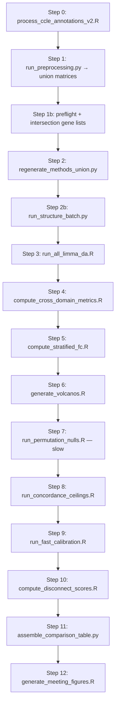

# Benchmark v2 — What’s Running, Where Outputs Live, How to Present

This is the **single entry point** for the CPTAC–CCLE harmonization benchmark used in slides: design, file layout, orchestration, and a **presentation checklist**.

For a **paper- / conference-ready** narrative (full data pipeline, system design, statistical procedures, metrics glossary, figure catalog, reproducibility), see **[END_TO_END_TECHNICAL_REPORT.md](END_TO_END_TECHNICAL_REPORT.md)**.

For **cloning on a new machine / lab fork** (`CPTAC_LOCAL_MIRROR`, R repo root, CI conventions), see **[LAB_ONBOARDING.md](LAB_ONBOARDING.md)**.

---

## 1. What this benchmark is

**Question:** After aligning CPTAC tumor proteomics and CCLE cell-line proteomics (same genes, shared tasks), do **representation-level** analyses agree across domains on known biology?

**Two tasks**

| Task | Contrast | Role in the story |
|------|----------|-------------------|
| **breast_subtype** | Luminal vs Basal | Fine-grained subtype; CCLE arm uses **expanded v2 annotation** (8 Luminal + 17 Basal lines after HER2 exclusion and CAL120 merge; see Step 0). |
| **breast_vs_lung** | Breast vs Lung | Coarse tissue / lineage; CPTAC breast + lung studies; CCLE breast (from v2 breast lines) + lung from tissue map. |

**Four methods (representations)**

| Method | Meaning |
|--------|---------|
| **raw** | Union shared-gene matrix, no harmonization (baseline). |
| **bridge_shift** | Per-protein bridge-channel **location** correction (TMT-aware). |
| **bridge_scale** | Bridge **location + scale** correction. |
| **celligner** | cPCA residualization + **MNN** on bundled Broad Celligner Python port (`models/celligner-master/`). DE inside Celligner uses **R `limma` via `Rscript`** (no rpy2). Clustering uses **Scanpy Leiden (igraph)**. |

**Important distinction**

- **Native-domain inference** (e.g. MSstatsTMT on CPTAC where applicable) is the anchor for biology-destruction checks.
- **Representation-level** comparison uses **limma** on each method’s transformed matrix for fair cross-method comparison.

---

## 2. What “v1 vs v2” means here

| | **Earlier / smoke runs** | **Overnight benchmark v2** (`run_overnight_v2.sh`) |
|---|--------------------------|-----------------------------------------------------|
| **CCLE subtype** | Few lines (low power) | **25** cell lines (8 Luminal / 17 Basal) from `data/ccle/ccle_breast_subtype_annotations_v2.csv` |
| **Orchestrator** | Scattered scripts / `benchmark_results_union` smoke | **One script**, Steps 0–12, log + `comparison_summary.csv` |
| **Metrics** | Partial | Union + **intersection** FC metrics, permutation nulls, CPTAC + **CCLE split-half** ceiling, disconnect scores, meeting figures |

---

## 3. How the overnight pipeline runs (Steps 0–12)

Script: `scripts/benchmark/run_overnight_v2.sh`  
Prerequisites: `data/results/` CPTAC + CCLE gene matrices, venv with `PYTHONPATH=src`, optional `.[celligner]` + `mnnpy` for real Celligner (see [README](../README.md)).



- **Runtime:** Steps 7–8 dominate (often **hours** total); rest is usually minutes to tens of minutes.
- **Logs:** `reports/benchmark_master/logs/overnight_v2_YYYYMMDD_HHMMSS.log`
- **If Celligner deps missing:** Step 2 still writes `celligner` matrices in **scaffold** mode (concatenation placeholder). With deps fixed, log shows **`FULLY_IMPLEMENTED`**.

---

## 4. Where everything lives (paths)

### Union inputs / methods

| Path | Content |
|------|---------|
| `data/processed/union/shared_gene_matrix_breast_subtype.csv` | Genes × samples (CPTAC + CCLE) |
| `data/processed/union/sample_meta_breast_subtype.csv` | `sample_id`, `domain`, `condition`, … |
| `data/processed/union/` | Same for `breast_vs_lung` |
| `data/processed/methods/{raw,bridge_shift,bridge_scale,celligner}/transformed_{task}.csv` | Per-method matrices |
| `data/processed/ccle_breast_subtype_annotation_processed.csv` | One row per CCLE line (HER2 excluded from subtype task) |
| `data/processed/intersection_genes_*.txt` | High-coverage genes for FC nulls / metrics |

### Results (numbers for slides)

| Path | Content |
|------|---------|
| `reports/benchmark_master/benchmark_results/comparison_summary.csv` | **Main table:** structure, FC union/intersection, permutation z/p, ceilings, markers, destruction, disconnect |
| `reports/benchmark_master/benchmark_results/comparison_summary_tiered.csv` | Long format + **tier** (informative vs supplementary) |
| `reports/benchmark_master/benchmark_results/disconnect_scores.csv` | Disconnect-focused columns |
| `reports/benchmark_master/benchmark_results/{method}/{task}/representation_da/` | `cptac/da_limma_result.csv`, `ccle/da_limma_result.csv` (canonical); flat `da_cptac.csv` / `da_ccle.csv` are copies written by limma wrapper; `cross_domain_metrics.csv`, `fc_agreement.csv` |
| `reports/benchmark_master/benchmark_results/{method}/{task}/calibration/` | Permutation nulls, ceilings, marker sanity, biology destruction, residuals |

### Diagnostics (cohort / genes / QC text)

| Path | Content |
|------|---------|
| `reports/benchmark_master/diagnostics/gene_coverage_audit_*.csv` | CPTAC vs CCLE coverage → intersection story |
| `reports/benchmark_master/diagnostics/ccle_subtype_v2_validation.txt` | CCLE column presence |
| `reports/benchmark_master/diagnostics/ccle_sample_trace.txt` | Expected lines vs `sample_id` |
| `reports/benchmark_master/diagnostics/marker_presence_*.txt` | Markers in matrix |
| `reports/benchmark_master/diagnostics/fc_stratified_*.csv` | Stratified FC tables |

### Meeting figures (slide assets)

| Path | Content |
|------|---------|
| `reports/benchmark_master/meeting/figures/index.html` | Gallery (open in browser) |
| `reports/benchmark_master/meeting/figures/figure_manifest.csv` | Ordered list of figures |
| `reports/benchmark_master/meeting/figures/01_*.png` … `13_*.pdf` | Exported panels (when generation succeeded) |
| `reports/benchmark_master/benchmark_results/*/structure/` | PCA / structure summaries (paths referenced in manifest) |
| `reports/benchmark_master/marker_profiles/` | Marker profile PNGs |

---

## 5. Presentation checklist (suggested slide order)

1. **Problem:** Tumor (CPTAC) vs cell line (CCLE) proteomics — batch + domain effects; need comparable representations.
2. **Tasks:** Subtype (Luminal vs Basal) and Breast vs Lung; **CCLE subtype v2 = 25 lines** (HER2 out of subtype; CAL120 merged).
3. **Methods:** raw → bridge_shift → bridge_scale → celligner (one slide).
4. **Design:** Same genes, same limma protocol per method; intersection gene filter for FC nulls / cross-domain FC (cite diagnostics).
5. **Overview heatmap:** `03_comparison_table.png` or a filtered view of `comparison_summary.csv`.
6. **FC agreement:** `04_fc_scatter_panels.png` + 1–2 headline numbers from `comparison_summary.csv` (**`fc_correlation_intersection`**, **`fc_same_dir_intersection`**).
7. **Dilution / gene set:** `09_union_vs_intersection_*.pdf` + `gene_coverage_audit_*.csv` counts.
8. **Stratified FC:** `10_fc_stratified_*.pdf` (sig both vs neither).
9. **Calibration:** `02_concordance_ceiling_context.png` + permutation z/p columns.
10. **Disconnect:** `12_disconnect_combined.pdf` + `disconnect_scores.csv` (geometry gain vs DA gain).
11. **Volcanos / power:** `11_volcano_*.pdf`, `13_ccle_power_comparison_subtype.pdf`.
12. **Limitations:** BvL CPTAC = two studies; Celligner is aggressive; marker coverage (see `marker_presence_*.txt`).

**Speaker notes**

- Emphasize **intersection** FC for cross-domain agreement when explaining missingness.
- **bridge_shift** reuses **raw** permutation null for FC correlation (within-domain logFC unchanged by shift) — expected identical null for that pair.
- If presenting **Celligner**, confirm latest log shows **`FULLY_IMPLEMENTED`**, not scaffold.

---

## 6. How to re-run after code or annotation changes

```bash
cd /path/to/ProteomicsAllignment
export R_PROFILE_USER=/dev/null   # if no renv
nohup ./scripts/benchmark/run_overnight_v2.sh > /tmp/overnight_v2.out 2>&1 &
tail -f reports/benchmark_master/logs/overnight_v2_*.log   # newest file
```

Fast path (methods only, after union exists):

```bash
.venv/bin/python3 scripts/benchmark/regenerate_methods_union.py --repo .
```

---

## 7. Further reading (deeper design notes)

| Document | Topic |
|----------|--------|
| [docs/README.md](README.md) | All topic-level design notes (benchmark, preprocessing, structure, …) |
| [benchmark_pipeline_overview.md](../reports/benchmark_master/benchmark_pipeline_overview.md) | R `run_benchmark()` layout (orchestration = overnight shell) |
| [meeting_summary_for_olga_sarah.md](../reports/benchmark_master/meeting/meeting_summary_for_olga_sarah.md) | Narrative (update CCLE counts if it still says 4v4) |
| [BENCHMARKING_AND_SLIDES_REPORT.md](../reports/BENCHMARKING_AND_SLIDES_REPORT.md) | Earlier subtype benchmark + slides context |
| [PROJECT_REPORT.md](../PROJECT_REPORT.md) | Whole repo scope beyond benchmark |

---

## 8. What to commit vs keep local

- **Usually commit:** `scripts/`, `src/`, `configs/`, `models/celligner-master/` (code + vendored Celligner), `docs/`, `install_r_packages.R`, `pyproject.toml`, `README.md`.
- **Usually gitignored (see `.gitignore`):** `data/results/`, `data/pdc_psm/`, `.venv/`, `__pycache__/`, `*.log`, `presentation_materials/`.
- **Large local artifacts:** `data/processed/`, full `reports/benchmark_master/benchmark_results/` — decide per team policy; many teams **do not** commit regenerated CSVs/PNGs, only regenerate in CI or on demand.

---

## 9. One-folder presentation pack

From the repo root, run **`./scripts/presentation/prepare_all.sh`** to build **`presentation_materials/`** (tables, copied meeting/structure figures, profile plots, assumption PDFs, **`backup_slides/backup_content.md`**). See **`scripts/presentation/README.md`**.

---

*Last updated to align with `run_overnight_v2.sh` and Celligner Rscript + Leiden(igraph) stack.*
