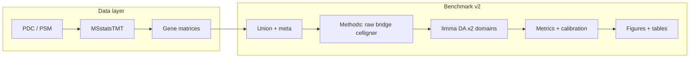

# End-to-End Technical Report: PDC Proteomics, CPTAC–CCLE Harmonization, and the Representation Benchmark

**Purpose of this document.** A single, **paper- and conference-ready** reference for (i) the **data pipeline** from public PDC data to gene matrices, (ii) **system design** (software, configuration, directories), (iii) **benchmark tasks and methods**, (iv) **statistical procedures and metrics**, (v) **figures and tables**, and (vi) **full reproducibility** (how to run everything).  
**Companion shorter doc:** [BENCHMARK_V2_AND_PRESENTATION.md](BENCHMARK_V2_AND_PRESENTATION.md) (slide checklist and path quick reference).  
**Repository overview:** [PROJECT_REPORT.md](../PROJECT_REPORT.md).

---

## Abstract

We describe an integrated computational workflow that (1) ingests **TMT proteomics** from the **Proteomic Data Commons (PDC)** and produces **study-level sample × gene** abundance matrices using **MSstatsTMT** and gene mapping; (2) builds **cross-domain union matrices** that jointly contain **CPTAC** tumor samples and **CCLE** cell-line samples on a **shared gene space** with explicit prevalence filtering and imputation; (3) applies **multiple harmonization representations**—**raw** (none), **bridge-aware** shift and shift+scale corrections informed by **TMT bridge channels**, and **Celligner**-style **contrastive PCA** plus **mutual nearest neighbors (MNN)** alignment; and (4) evaluates representations with a **fixed statistical protocol** (**limma** per domain), **cross-domain fold-change agreement** (full gene set and **intersection** genes with adequate coverage in both domains), **structure metrics** on a **fixed PCA basis**, **label-permutation nulls**, **within-domain concordance ceilings** (including **CCLE split-half** for the subtype task), **biology-destruction** relative to native CPTAC inference where applicable, **marker concordance**, **residual dependence**, and a **disconnect** score relating **geometry** change to **differential-abstraction** change. An orchestrating shell script runs all steps and emits a **comparison table**, **diagnostics**, and **meeting-ready figures**. This report is intended as **Methods / Supplementary Material** text and as **speaker notes** for conference presentations.

---

## 1. Introduction and goals

### 1.1 Scientific motivation

Tumor tissue (here **CPTAC** TMT proteomics) and **cell lines** (CCLE) differ by **biology**, **batch**, and **experimental design**. Harmonization methods aim to make domains more comparable, but can **remove domain-specific variation** that overlaps real biology. We need **transparent benchmarks** that (a) hold **tasks and genes** as constant as possible across methods, (b) separate **native** (design-aware) inference from **representation-level** inference, and (c) report **calibrated** agreement (relative to **null** and **ceiling**).

### 1.2 What this repository delivers

| Layer | Deliverable |
|-------|-------------|
| **Data** | Reproducible path from PDC manifests → PSM → MSstatsTMT → **gene matrices** per study + CCLE. |
| **Harmonization benchmark** | Union matrices, four representations, **16 limma** runs (4 methods × 2 tasks × 2 domains), **calibration**, **one master comparison table**, **figure exports**. |
| **Documentation** | This report + pipeline README + presentation checklist. |

---

## 2. Data provenance and the upstream pipeline (PDC → gene matrix)

### 2.1 Sources

- **CPTAC** studies used in the default benchmark configuration include at least **PDC000120** (breast) and **PDC000153** (lung), with gene matrices read from `data/results/{study_id}/gene_matrix.csv` after MSstatsTMT processing. Additional studies may appear in `configs/preprocessing/default.yaml`.
- **CCLE** proteomics are expected as a consolidated matrix at `data/results/CCLE_corrected/gene_matrix.csv` (paths configurable in YAML). **Sample / tissue metadata** for CCLE column interpretation may be supplied via `data/ccle_peptide/sample_info_ccle.csv` (see config).

### 2.2 Stages (conceptual)

Detailed step-by-step documentation: **[data/PIPELINE_README.md](../data/PIPELINE_README.md)**. Conceptually:

1. **Manifest → downloads:** PDC file manifest CSVs under `data/manifests/` drive retrieval of PSM files into `data/pdc_psm/` (git-ignored when large).
2. **PSM → MSstatsTMT input:** Parsing and channel detection for **multiple TMTplex sizes**; **exactly one bridge channel per mixture** (Condition = Norm).
3. **MSstatsTMT:** Protein summarization, normalization; **bridge channels removed** from reported sample columns.
4. **Protein → gene:** Mapping via **Bioconductor** `org.Hs.eg.db` (or mouse equivalent if configured).
5. **Output:** Per-study **gene × sample** matrix (orientation may vary by writer; downstream loaders standardize).

**Typical orchestration (data directory):** `data/run_pipeline_per_manifest.sh` (see root [README.md](../README.md)).

### 2.3 What the benchmark assumes is already on disk

The harmonization benchmark **does not** re-run PDC download or MSstatsTMT by default. It assumes:

- `data/results/PDC000120/gene_matrix.csv` (and subtype mapping for mixture-balanced CPTAC subtype subsetting, where used).
- `data/results/PDC000153/gene_matrix.csv` for lung.
- `data/results/CCLE_corrected/gene_matrix.csv` for CCLE.
- Optional: `data/ccle/ccle_breast_subtype_annotations_v2.csv` for **curated** Luminal/Basal/HER2 labels and column identifiers.

---

## 3. Benchmark inputs: union construction and cohort definitions

### 3.1 Software entry point

- **Python:** `scripts/run_preprocessing.py` with `configs/preprocessing/default.yaml` and per-task YAML under `configs/tasks/` (`breast_subtype.yaml`, `breast_vs_lung.yaml`).
- **Key parameters (default YAML):** `shared_space.join_strategy` (typically **intersection** of genes across CPTAC studies and CCLE), `filtering.min_prevalence` (e.g. **0.70** in at least one domain), `filtering.min_sd`, imputation strategy (**within-domain gene median** where implemented).

### 3.2 Task A — Breast subtype (Luminal vs Basal)

- **Contrast:** Luminal vs Basal (two-group).
- **CPTAC:** Mixture-balanced Luminal/Basal subset per task config (PAM50-driven mapping; exact counts in `data/processed/union/sample_meta_breast_subtype.csv`).
- **CCLE (benchmark v2):** Curated annotation `data/ccle/ccle_breast_subtype_annotations_v2.csv`. **HER2** lines are **excluded** from the subtype contrast. **CAL120** appears on two plexes; columns are **averaged** into one **`CAL120_BREAST`** column in preprocessing (`average_cal120_ccle_columns` in `src/harmonize/preprocessing/metadata.py`). After deduplication: **8 Luminal + 17 Basal = 25** CCLE samples for subtype.
- **Outputs:** `data/processed/union/shared_gene_matrix_breast_subtype.csv`, `sample_meta_breast_subtype.csv`, `feature_meta_breast_subtype.csv`.

### 3.3 Task B — Breast vs lung

- **Contrast:** Breast vs Lung.
- **CPTAC:** Breast samples from PDC000120; lung from PDC000153 (see task YAML).
- **CCLE:** Breast lines from full v2 breast annotation (includes HER2 as **Breast**); lung lines from **tissue map** (`sample_info_ccle.csv`) for columns labeled lung.
- **Outputs:** `data/processed/union/shared_gene_matrix_breast_vs_lung.csv` and matching metadata files.

### 3.4 Gene intersection for cross-domain FC metrics

Genes with **low coverage in one domain** can **dilute** Pearson correlation of log-fold-changes. The benchmark therefore defines an **intersection gene list** (e.g. >30% non-missing per domain in preflight; see `scripts/benchmark/preflight_diagnostics.R` and `compute_intersection_masks.R`). Lists are written to `data/processed/intersection_genes_{task}.txt` (and mirrored under `union/` / `processed_union/` as implemented). **Structure metrics** use the **full** feature set used for PCA in the structure module unless otherwise noted; **FC correlation nulls** use the **same gene filter** as the observed FC statistic when intersection files are passed (see Step 7).

---

## 4. Methods under comparison (representations)

All methods share the **same samples and genes** entering each task’s union pipeline (subject to per-method filtering only where explicitly stated, e.g. Celligner internal NA handling).

### 4.1 Raw

No harmonization: the union matrix is copied to `data/processed/methods/raw/transformed_{task}.csv`.

### 4.2 Bridge shift (`bridge_shift`)

**Intent:** Align **CCLE** to **CPTAC** **location** (median) on **per-protein bridge-channel** summaries, preserving **within-domain contrasts** for shift-only correction (within-domain **logFC** invariant to constant shift per gene).  
**Implementation:** `scripts/benchmark/bridge_aware_correction.R` in **shift_only** mode; bridge tables under `reports/benchmark_master/methods/bridge_aware/`. Estimators default to **median** (center) and **MAD** (scale metadata; scale not applied in shift_only).

### 4.3 Bridge scale (`bridge_scale`)

**Intent:** Apply **location + scale** harmonization using bridge-derived **MAD** (and medians), increasing aggressiveness vs shift-only.  
**Implementation:** Same R script, **shift_and_scale** mode.

### 4.4 Celligner (`celligner`)

**Intent:** **Contrastive PCA (cPCA)** to regress domain-enriched axes from reference (CCLE) and target (CPTAC), then **MNN** correction (Marioni et al. implementation via **mnnpy**).  
**Implementation:** `scripts/methods/run_celligner_representation.py` + vendored `models/celligner-master/`.

**Benchmark-specific adaptations:**

- **DE step (limma inside Celligner clustering):** **R `limma`** invoked via **`Rscript`** temporary scripts (`celligner/limma.py`) — **no rpy2** requirement.
- **Clustering:** **Scanpy Leiden** with **`flavor="igraph"`** (avoids deprecated `louvain` / `pkg_resources` stack on modern Python).
- **PCA dimensionality:** Default upstream `PCA_NCOMP=70` is **incompatible** with small CCLE arms; the wrapper sets `pca_ncomp = min(70, n_min_domain - 1, n_genes - 1)` with `low_mem` for large **p × n**.

**Status check:** Successful runs log **`[celligner] Status: FULLY_IMPLEMENTED`**. Missing dependencies or runtime failures fall back to a **scaffold** matrix (concatenation placeholder) and **`SCAFFOLDED_*`** status — **not** equivalent to true Celligner alignment.

---

## 5. System design

### 5.1 Language roles

| Component | Language | Role |
|-----------|----------|------|
| Preprocessing / assembly | Python (`harmonize` in `src/`) | Load matrices, build shared space, metadata, CAL120 merge |
| Bridge correction | R | Deterministic per-gene correction from bridge summaries |
| Celligner driver | Python | Celligner + mnnpy + scanpy |
| Bulk benchmark steps | R | limma wrappers, permutation, ceilings, calibration, figures |
| Assembly | Python | Wide comparison table |

### 5.2 Configuration

- **`configs/preprocessing/default.yaml`:** Data paths, prevalence, imputation, output directory default.
- **`configs/tasks/breast_subtype.yaml`**, **`breast_vs_lung.yaml`:** Studies, conditions, CCLE annotation paths, markers.

### 5.3 Orchestration

**Canonical full run:** `scripts/benchmark/run_overnight_v2.sh`  
Exports `PYTHONPATH=<repo>/src`, prefers `<repo>/.venv/bin/python3`, sets `R_PROFILE_USER=/dev/null` when `renv/activate.R` is absent (avoids broken renv hooks during `Rscript` calls from Python).



---

## 6. Statistical and computational evaluation (Steps 2b–12)

### 6.1 Structure metrics (Step 2b)

**Script:** `scripts/benchmark/run_structure_batch.py`.  
**Idea:** On a **fixed PCA basis** (shared across methods for comparability in the reported implementation), quantify how much **domain** (CPTAC vs CCLE) and **condition** (e.g. Luminal vs Basal) explain variance along leading PCs (**R²**), plus **silhouette**, **kNN purity**, optional **classification accuracy**. Reported in `comparison_summary.csv` under `struct_*`.

### 6.2 Differential abundance — representation level (Step 3)

**Script:** `scripts/benchmark/run_all_limma_da.R` calling `src/harmonize/benchmark/calibration/limma_da_wrapper.R` (or paths as in repo).  
**Design:** For each **method × task × domain**, **limma** on the transformed matrix with explicit **two-group contrast** (`contrast_b - contrast_a`; breast subtype: **Luminal − Basal**). Canonical tables: `representation_da/cptac/da_limma_result.csv` and `representation_da/ccle/da_limma_result.csv`. The wrapper also writes flat `da_cptac.csv` / `da_ccle.csv` as identical copies for convenience.

### 6.3 Cross-domain agreement (Step 4)

**Script:** `compute_cross_domain_metrics.R`.  
**Metrics:** Merge CPTAC and CCLE **gene-level logFC**; compute **Pearson r**, **fraction same sign**, **median |ΔlogFC|**, optionally **marker** concordance. Reported for **union** and **intersection** gene sets (`fc_correlation_union`, `fc_correlation_intersection`, etc.).

### 6.4 Stratified FC (Step 5)

**Script:** `compute_stratified_fc.R`.  
**Strata:** e.g. significant in both domains, CPTAC-only, CCLE-only, neither — to separate **shared biology** from **noise-dominated** genes.

### 6.5 Volcano plots (Step 6)

**Script:** `generate_volcanos.R` — diagnostic **raw** CPTAC vs CCLE volcanos (representation-level limma) for slide export.

### 6.6 Permutation nulls (Step 7)

**Script:** `run_permutation_nulls.R` → `permutation_null.R`.  
**Procedure:** Permute **condition labels within each domain**; re-run limma per permuted set; recompute **FC correlation** (and related stats) on **intersection genes** when lists are supplied. **Optimization:** **`bridge_shift` reuses `raw` null** files (within-domain logFC identical under shift-only for the implemented correction). **Runtime:** dominates total wall time (often hours).

### 6.7 Concordance ceilings (Step 8)

**Script:** `run_concordance_ceilings.R`.  
**CPTAC:** Split-half (or held-out) **within-domain** correlation of **logFC** vectors. **CCLE subtype:** **Split-half** on the larger group where configured (`--ccle-split-half`), replacing jackknife-style proxies when sample counts are sufficient. Summaries feed **`concordance_ceiling_fc_corr`**, **`ccle_ceiling_fc_corr`**, and **calibrated** observed/ceiling ratios.

### 6.8 Fast calibration (Step 9)

**Script:** `run_fast_calibration.R` — **biology destruction** (CPTAC method DA vs native reference), **marker sanity**, **residual dependence** (effective sample size / correlation structure of residuals).

### 6.9 Disconnect scores (Step 10)

**Script:** `compute_disconnect_scores.R`.  
**Concept:** Compare **geometry improvement** (e.g. drop in domain R² on PC1 vs raw) to **DA improvement** (intersection FC correlation vs raw, normalized by ceiling). **Disconnect** flags methods that **mix domains** without **gaining** cross-domain DA fidelity.

### 6.10 Master table and figures (Steps 11–12)

- **`assemble_comparison_table.py`:** One wide row per **method × task** → `benchmark_results/comparison_summary.csv`.
- **`generate_meeting_figures.R`:** Exports PNG/PDF gallery and `meeting/figures/index.html`.

---

## 7. Metrics glossary (`comparison_summary.csv`)

The master table is **wide**; column families below. **Note:** Some columns appear **duplicated by name** in the CSV (legacy assembly); use the **tiered** long table `comparison_summary_tiered.csv` for one row per metric if needed.

| Prefix / name | Meaning |
|----------------|---------|
| `method`, `task` | Representation and biological task |
| `struct_n_samples`, `struct_n_genes` | Structure analysis sample/gene counts |
| `struct_pca_basis` | e.g. **fixed** basis for cross-method comparability |
| `struct_pca_variance_explained` | Variance explained vector (JSON-like string) |
| `struct_domain_r2_pc*` | Fraction of PC variance explained by **CPTAC vs CCLE** |
| `struct_condition_r2_pc*` | Fraction explained by **biological condition** |
| `struct_silhouette_*`, `struct_knn_purity_*` | Clustering geometry summaries |
| `fc_correlation`, `fc_same_dir_frac` | Primary FC agreement (assembly may mirror union or intersection) |
| `fc_correlation_union` / `_intersection` | Explicit **gene-set** split |
| `n_genes_union` / `n_genes_intersection` | Gene counts for those metrics |
| `permutation_p_fc_corr`, `permutation_z_fc_corr` | Permutation **p-value** and **z-score** for FC correlation |
| `permutation_p_same_dir` | Null for same-direction fraction |
| `concordance_ceiling_fc_corr` | Within-domain **ceiling** for FC correlation |
| `ccle_ceiling_fc_corr` | CCLE-specific ceiling when computed |
| `calibrated_fc_corr`, `calibrated_fc_corr_intersection` | Observed / ceiling style calibration |
| `marker_sanity_*` | Marker direction checks |
| `biology_destruction_*` | Retention / shrinkage vs native CPTAC |
| `residual_*`, `n_eff_*` | Residual dependence diagnostics |
| `n_ccle_samples` | CCLE sample count for task (e.g. **25** subtype v2) |
| `disconnect_score`, `geom_improvement`, `da_improvement` | Disconnect decomposition |

---

## 8. Figures and tables (conference package)

### 8.1 Primary tables

| Artifact | Path |
|----------|------|
| Master comparison | `reports/benchmark_master/benchmark_results/comparison_summary.csv` |
| Tier-tagged long | `benchmark_results/comparison_summary_tiered.csv` |
| Disconnect | `benchmark_results/disconnect_scores.csv` |
| Per-gene FC merge | `.../representation_da/fc_agreement.csv` |
| Cross-domain by gene set | `.../representation_da/cross_domain_metrics.csv` |

### 8.2 Meeting figure set (exported)

Manifest: `reports/benchmark_master/meeting/figures/figure_manifest.csv`.  
Browser index: `meeting/figures/index.html`.

| ID | File pattern | Intended message |
|----|----------------|------------------|
| 1 | `01_contrast_validation_table.png` | Marker **sign** consistency on raw |
| 2 | `02_concordance_ceiling_context.png` | Observed vs **null** vs **ceiling** |
| 3 | `03_comparison_table.png` | **Heatmap** of key metrics |
| 4 | `04_fc_scatter_panels.png` | CPTAC vs CCLE **logFC** grid |
| 5 | `structure/*` | **PCA** by domain/condition (per manifest) |
| 6 | `marker_profiles/*` | **Marker** trajectories |
| 7 | `07_subtype_diagnostic.png` | Subtype / contrast narrative |
| 8 | `08_roadmap.png` | Project phases |
| 9 | `09_union_vs_intersection_*.pdf` | **Missingness dilution** |
| 10 | `10_fc_stratified_*.pdf` | **Strata** by significance |
| 11 | `11_volcano_*.pdf` | **Volcano** CPTAC vs CCLE |
| 12 | `12_disconnect_combined.pdf` | **Geometry vs DA** tradeoff |
| 13 | `13_ccle_power_comparison_subtype.pdf` | **v1 vs v2** CCLE power |

### 8.3 Diagnostics (supplementary)

Under `reports/benchmark_master/diagnostics/`: gene coverage audits, CCLE validation traces, marker presence logs, stratified FC CSVs.

---

## 9. Reproducibility: environment and commands

### 9.1 R

```bash
Rscript install_r_packages.R
```

Installs CRAN packages and Bioconductor packages including **`limma`** (required for Celligner’s internal DE and for benchmark R steps as configured). List: [requirements-R.txt](../requirements-R.txt).

### 9.2 Python

```bash
python3 -m venv .venv
source .venv/bin/activate   # Windows: .venv\Scripts\activate
pip install -e ".[celligner]"   # core + Celligner stack
pip install ./models/celligner-master/mnnpy
# If mnnpy fails on Python 3.13:
#   cd models/celligner-master/mnnpy && cython mnnpy/_utils.pyx && cd ../.. && pip install ./models/celligner-master/mnnpy
```

Set **`PYTHONPATH=<repo>/src`** for modules under `src/harmonize/` (the overnight script does this).

**Portable clones (no hardcoded home paths):** set **`CPTAC_LOCAL_MIRROR`** to the directory that contains CPTAC study subfolders so `data/sample_files_msstats_tmt.csv` resolves; R scripts under `scripts/benchmark/` use **`harmonize_paths.R`** (optional **`PROTEOMICS_ALIGNMENT_ROOT`** override). See **[LAB_ONBOARDING.md](LAB_ONBOARDING.md)**.

### 9.3 Full benchmark (all steps)

```bash
cd /path/to/ProteomicsAllignment
export R_PROFILE_USER=/dev/null   # when not using renv
./scripts/benchmark/run_overnight_v2.sh
```

Log: `reports/benchmark_master/logs/overnight_v2_*.log`.

### 9.4 Partial re-runs

| Goal | Command |
|------|---------|
| Method matrices only | `.venv/bin/python3 scripts/benchmark/regenerate_methods_union.py --repo .` |
| After union exists | Same; then re-run R steps 2b–12 manually if avoiding Step 1 |

---

## 10. Limitations (disclose in paper/talk)

1. **Study confounding (BvL CPTAC):** Breast and lung come from **different CPTAC studies**; cross-domain FC agreement is not a pure cell-autonomous readout.
2. **Representation limma ≠ MSstatsTMT:** TMT structure is not preserved after matrix harmonization; **limma** is used for **fair cross-method** comparison, not as a drop-in for spectral design.
3. **Gene identity:** Mapping and symbol collapse affect **which genes** align across domains.
4. **Celligner stochasticity / clustering:** Leiden resolution and high **MNN**/`cPCA` aggressiveness can **distort** subtype-relevant axes; **disconnect** metrics are there to surface this.
5. **Scaffold mode:** If Celligner dependencies fail, reported **celligner** rows reflect a **placeholder** matrix — always verify **`FULLY_IMPLEMENTED`** in logs for real Celligner results.

---

## 11. References (code and external methods)

- **MSstatsTMT:** Bioconductor package (cited in primary proteomics pipeline publications).
- **limma:** Ritchie et al., *Nucleic Acids Research* (2015).
- **Celligner:** Warren et al., *Nature Communications* (2021) — conceptual; this repo uses a **Python port** in `models/celligner-master/` adapted for proteomics-scale matrices.
- **MNN:** Haghverdi et al.; **mnnpy** implementation.
- **Repository paths:** `scripts/benchmark/`, `src/harmonize/`, `configs/`, `docs/BENCHMARK_V2_AND_PRESENTATION.md`.

---

## Appendix A. Step index (`run_overnight_v2.sh`)

| Step | Script | Purpose |
|------|--------|---------|
| 0 | `process_ccle_annotations_v2.R` | Process v2 CCLE subtype annotation; validation trace |
| 1 | `run_preprocessing.py` | Union matrices → `data/processed/union/` |
| 1b | `preflight_diagnostics.R`, `compute_intersection_masks.R` | Audits + intersection gene lists |
| 2 | `regenerate_methods_union.py` | raw / bridge / celligner matrices |
| 2b | `run_structure_batch.py` | Structure metrics |
| 3 | `run_all_limma_da.R` | 16 limma runs |
| 4 | `compute_cross_domain_metrics.R` | Union + intersection FC metrics |
| 5 | `compute_stratified_fc.R` | Strata by significance |
| 6 | `generate_volcanos.R` | Volcano exports |
| 7 | `run_permutation_nulls.R` | Permutation nulls (slow) |
| 8 | `run_concordance_ceilings.R` | Ceilings + CCLE split-half |
| 9 | `run_fast_calibration.R` | Destruction, markers, residuals |
| 10 | `compute_disconnect_scores.R` | Disconnect |
| 11 | `assemble_comparison_table.py` | `comparison_summary.csv` |
| 12 | `generate_meeting_figures.R` | Meeting figures + index |

---

*Document version: aligned with repository layout and `run_overnight_v2.sh` as of creation. Update §9 if dependency pins change.*
