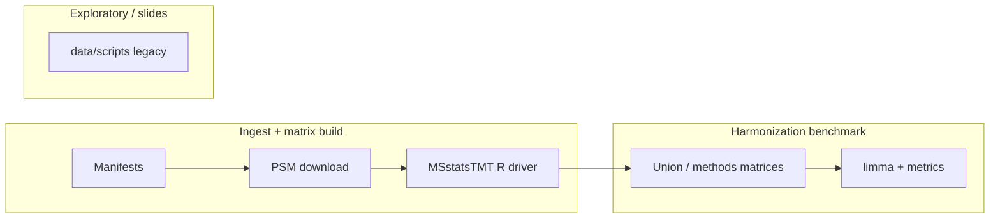

# Naming conventions and where things live

The repo grew in stages: CPTAC preprocessing stayed under **`data/`**, the harmonization benchmark under **`scripts/benchmark/`**, and exploratory analyses under **`data/scripts/`**. That split is **historical**, not an ideal taxonomy. This page is the **canonical map** so you can navigate without reshuffling the tree.

---

## Mental model (three stages)

| Stage | What it is | **Canonical code / docs** (today) |
|-------|------------|-----------------------------------|
| **1 — Matrix build** | PDC → PSM → `gene_matrix.csv` | **`data/`** root: `run_pipeline_per_manifest.sh`, `pdc_manifest_downloader.py`, `pdc_psm_to_msstatsTMT_protein_matrix.R` · doc table: [`../pipeline/psm_to_gene_matrix/README.md`](../pipeline/psm_to_gene_matrix/README.md) · long form: [`../data/PIPELINE_README.md`](../data/PIPELINE_README.md) |
| **2 — Benchmark** | Union, harmonizers, limma, tables | **`scripts/benchmark/`** (`run_overnight_v2.sh`) · **`src/harmonize/`** (Python package) · **`configs/`** |
| **3 — Exploratory** | Subtype DA, v1 plots, one-offs | **`data/scripts/`** (legacy paths; many reports cite them) · **new** scripts → **`scripts/exploratory/`** |

**Rule of thumb:** if it needs **PDC URLs** or **`.sample.txt`**, look under **`data/`** first. If it needs **existing `gene_matrix.csv` + YAML tasks**, look under **`scripts/benchmark/`** and **`configs/`**.

---

## Known naming / path quirks (we keep them on purpose)

| Quirk | Why it persists |
|-------|-----------------|
| **`reports/benchmark_master/`** holds CSV “results” | Renaming to `results/` would break R/Python repo-root resolution and many docs. Treat **`reports/benchmark_master/benchmark_results/`** as the **numerical output home**. |
| **`data/scripts/`** vs **`scripts/`** | Preprocessing drivers live in **`data/`**; benchmark drivers in **`scripts/`**. **`data/scripts/`** is **not** the manifest→matrix pipeline — see [`../data/scripts/README.md`](../data/scripts/README.md). |
| **`ProteomicsAllignment` repo folder spelling** | Historical; do not rename the clone path in shared instructions without a coordinated team move. |
| **`scripts/preprocessing/`** has almost no executables | It is a **doc index**; real shell/R for stage 1 stay in **`data/`** — see [`../scripts/preprocessing/README.md`](../scripts/preprocessing/README.md). |
| Method IDs in YAML (`raw`, `bridge_shift`, …) vs file names (`run_overnight_v2.sh`) | IDs are **stable API** for configs and tables; script names can differ — always grep **`configs/methods/`** for the mapping. |

---

## Conventions for **new** files (please follow)

| Artifact | Convention | Example |
|----------|------------|---------|
| **Python** | `snake_case.py` under `src/harmonize/` (library) or `scripts/` (runnable) | `regenerate_methods_union.py` |
| **R (benchmark)** | `snake_case.R` under `scripts/benchmark/` | `run_all_limma_da.R` |
| **Shell drivers** | `verb_noun.sh`; run from documented cwd | `run_overnight_v2.sh` (repo root) |
| **YAML configs** | Lowercase; method **`id`** matches column names in summary CSVs | `configs/methods/bridge_aware.yaml` |
| **Markdown docs** | `SCREAMING_SNAKE` only for top-level runbooks (`HOW_TO_RUN_EVERYTHING.md`); otherwise `snake_case.md` or `Topic_Title.md` matching existing `docs/` style | `INFERENCE_BASELINES.md` |
| **Data paths in new code** | Prefer **`PROTEOMICS_ALIGNMENT_ROOT`**, **`CPTAC_LOCAL_MIRROR`**, or paths from **`configs/preprocessing/default.yaml`** — no `/Users/...` | See [`LAB_ONBOARDING.md`](LAB_ONBOARDING.md) |

When adding a **new** exploratory script, use **`scripts/exploratory/`** and mention it in your PR description; avoid adding to **`data/scripts/`** unless you are extending an existing provenance chain there.

---

## Quick path lookup

| I need… | Go to |
|---------|--------|
| Subtype / biospecimen / CCLE label tables (tracked) | [`../data/annotations/README.md`](../data/annotations/README.md), [`../data/biospecimen/README.md`](../data/biospecimen/README.md), [`../data/ccle/README.md`](../data/ccle/README.md) |
| Install + verify | [`../environment/README.md`](../environment/README.md), `scripts/verify_repro_setup.py` |
| Full run order | [`HOW_TO_RUN_EVERYTHING.md`](HOW_TO_RUN_EVERYTHING.md) |
| Layout philosophy (no big moves) | [`../REPO_LAYOUT_PLAN.md`](../REPO_LAYOUT_PLAN.md) |
| Audit / ignore policy | [`../REPO_AUDIT.md`](../REPO_AUDIT.md) |
| MSstatsTMT vs limma | [`INFERENCE_BASELINES.md`](INFERENCE_BASELINES.md) |

---

## If you want a **physical** cleanup later

That means a dedicated refactor: `git mv` + update every reference in R/shell/Python/markdown, then re-run `verify_repro_setup.py` and a benchmark dry subset. Until then, **this document + `pipeline/`** are the stable “naming layer” on top of the scattered tree.
